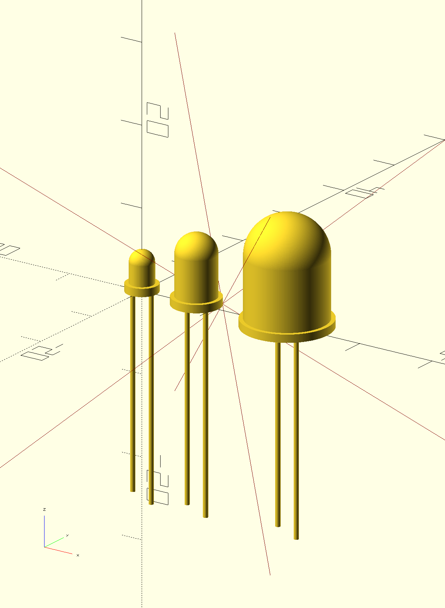

# tht-leds
An OpenSCAD library to draw THT LEDs.

.

## Installation
Add a git submodule to your project:

```sh
git submodule add leds https://github.com/mmalecki/openscad-leds
```

## Usage
```openscad
use <leds/leds.scad>;

led_3mm();
translate([7.5, 0, 0]) led_5mm();
translate([20, 0, 0]) led_10mm();
```

## API

### `led(d, protrusion_d, head_h, raster = 0, protrusion_h = 1, anode_l = 25.4, cathode_l = 24.4, terminal_d = 0.6)`
Draw an arbirtrary LED, with a diameter of `d`, protrusion with a diameter of
`protrusion_d` and a head height (including protrusion) `head_h`.

Optionally, if `raster` is specified (not 0), draw an anode of length `anode_l`,
a cathode of length `cathode_l`, with terminal diameters of `terminal_d`.

### `led_3mm`, `led_5mm`, `led_10mm`
Draw a LED of respective size, based on estimated sizes of respective LEDs.
